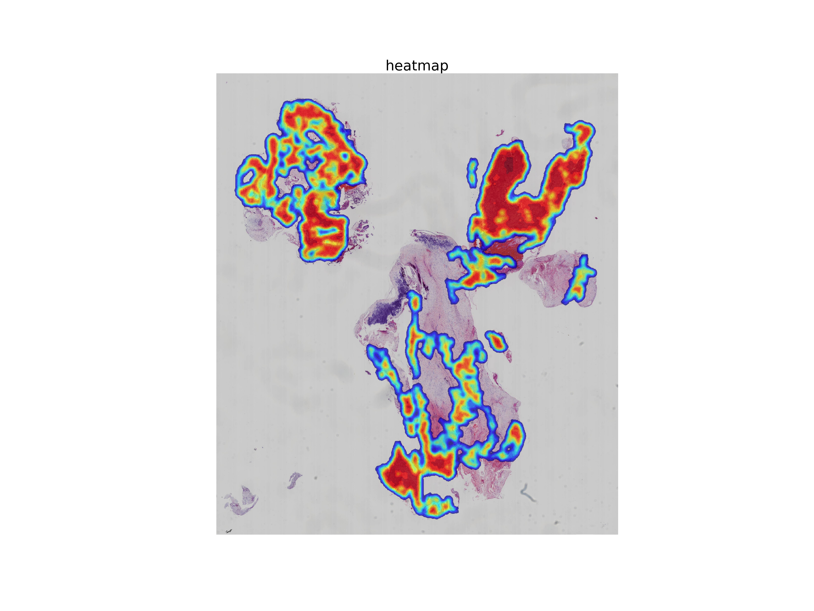

# Scale Rate Encoding Implementation in Darknet & Swin Transformer

## Overview
This project implements **Scale Rate Encoding (SRE)** using two backbone architectures:
- **Darknet** (used in YOLO series)
- **Swin Transformer**

## Usage

### 1. Inference with CSPDarknet + SRE
Run inference on a whole-slide image (.svs) using the CSPDarknet backbone with Scale Rate Encoding.
```bash
python infer_SREDarknet.py
```
### 2.  **Inference by Swin Transformer+SRE for one slide(.svs) **：
```bash
    python infer_SREswin.py
```
### 3.  **Inference by resnet for one slide(.svs) **：
```bash
    python infer_resnet.py
```    

---


## Dataset

### Synthetic Dataset Construction
- **Purpose**: Simulate realistic medical imaging conditions in pathology.
- **Features**:
  - Varied staining, noise, and resolution levels.
  - Augmented with scale variations to test scale-encoding robustness.
  - Annotated patches for classification or detection tasks.
- **Original Dataset**: The original dataset is not applicable, necessitating the creation of a synthetic alternative.

---

## Pretrained Weights for Backbone Networks

### 1. Darknet (YOLO)
- **Official GitHub Repository**:  
- **YOLO Pretrained Weights**:  
  - Includes weights for YOLOv3, YOLOv4, etc., trained on ImageNet and COCO.

### 2. Swin Transformer
- **Official GitHub Repository**:  
- **Pretrained Models**:
  - Check the `README.md` for links to models trained on ImageNet.
  - Supports variants: Swin-Tiny, Swin-Small, Swin-Base, Swin-Large.

### 3. Baidu Netdisk
- **Link**: https://pan.baidu.com/s/1pEkNFg-Exv5Hv2wraQHIMw?pwd=mnzy 
- **Extraction Code**: `mnzy`

---

## Benchmarking ResNet/DenseNet with Global Maximum Pooling (GMP)

Run the following script to benchmark CNN architectures enhanced with **Global Maximum Pooling**:

```bash
train_resnet_gmp.py
resnet152 + GMP: network_resnet_gmp.py
densenet161 + GMP: network_densenet_gmp.py 

  
     

